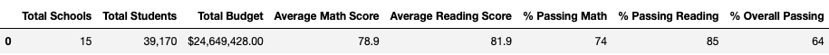
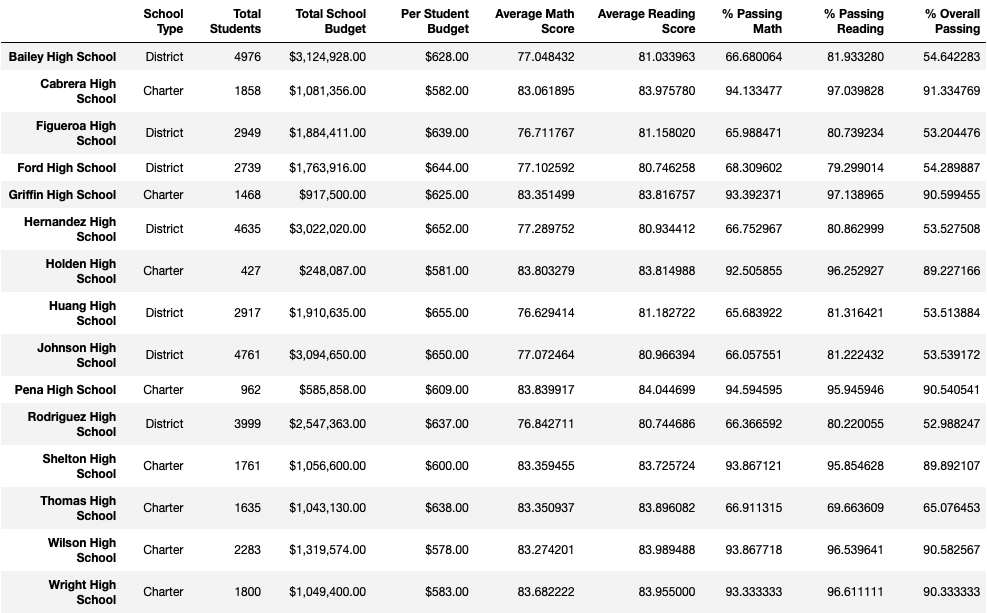
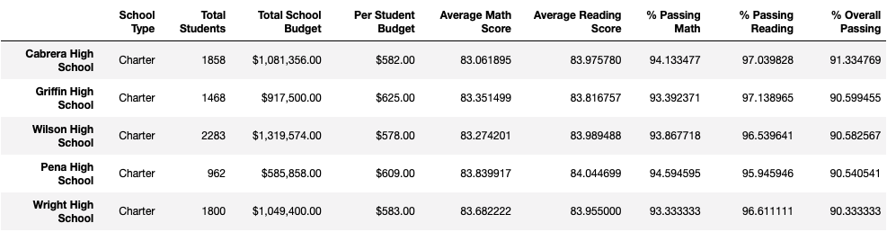
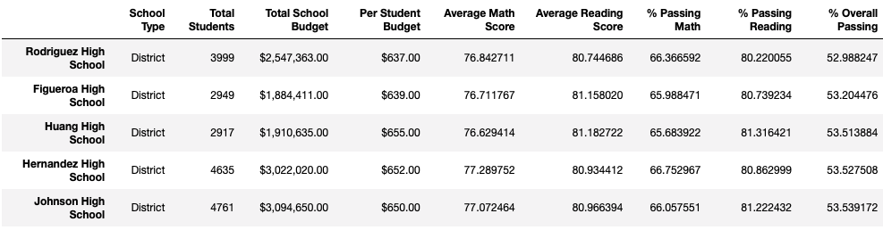
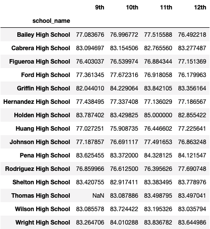
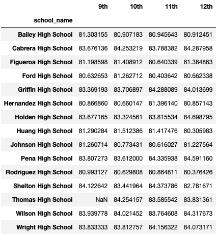
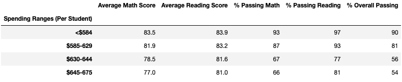
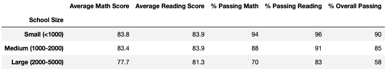
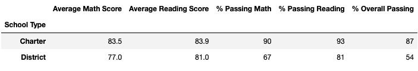

# School_District_Analysis
## Challenge

### Overview
After gathering and analyzing data from local school districts to help with standardist testing proficiency and patterns, it was discovered that the grades of the ninth graders at Thomas High School had been changed. After discussions with the school superintendent it was decided that the best course of action is to replaced the ninth-grade math and reading scores but keep the rest of their data. 

### Results
#### District Summary

The removal of the Thomas High School 9th graders had a slight affect on the overall districts scores. There was a drop in Average Math Score by 0.1 from 79 to 78.9 as well as a 1% decrease in '% Passing Math', '% Passing Reading', and '% Overall Passing'.

#### School Summary

In the school summary Thomas High School had significant drops in "% Passing Math", "% Passing Reading" and "% Overall Passing" due to the removal of the 9th grade students scores. Average math scores derease from 83.42 to 83.35 and average reading scores increased slightly from 83.85 to 83.896.

#### Top 5 Performing Schools

The top 5 performing schools changed as Thomas High School is now no longer in the top performing schools and Wright High School got added to the list in its place.

#### Bottom 5 Performing Schools

The bottom 5 performing schools did not change.

#### Math Scores by Grade

Math scores by grade are just shown as NaN for 9th graders at Thomas High School 

#### Reading Scores by Grade

Reading scores by grade are just shown as NaN for 9th graders at Thomas High School 

#### Scores by Spending Range

Because Thomas High School was in the $630-644 spending range, there was about a 7% decrease in the %Passing Reading and % Overall Passing categories and a 6% decrease in the % Passing Math

#### Scores by School size

Because Thomas High School was in the Medium Sized School category, there was a 6% decrease in the % Passing Math, % Passing Reading, and % Overall Passing, but no change in Average scores.

#### Scores by School Type

Because Thomas High School is a Charter school there was a 4% decrease in % Passing Math and % Passing Reading and a 3% decrease in % Overall Passing.
